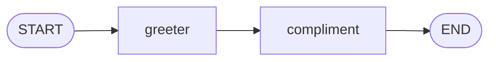
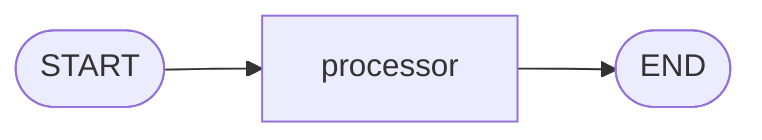
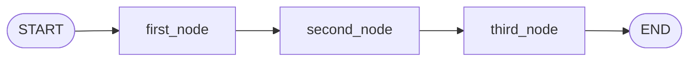
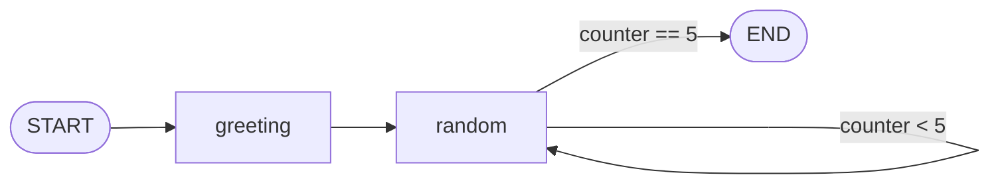

# lalalangraph

A small [LangGraph](https://github.com/langchain-ai/langgraph) sandbox for learning how to build stateful, node-based graphs. Each file in `graphs/` isolates one idea and builds on the one before it.

## Getting started

Requirements:

- Python >= 3.14
- [uv](https://github.com/astral-sh/uv) for dependency management

```bash
uv sync                                    # install dependencies
uv run python graphs/hello_world_graph.py  # run any example
```

## Layout

```
graphs/    one self-contained graph per file, each runnable on its own
main.py    project stub, not part of the examples
```

## Examples

Read them in this order — each introduces one new piece of the LangGraph API.

| Graph | Shape | Introduces |
| --- | --- | --- |
| [hello_world_graph.py](#hello_world_graphpy) | Two nodes in a line | `add_node`, `add_edge`, `set_entry_point` |
| [multiple_inputs_graph.py](#multiple_inputs_graphpy) | One node, several state fields | Reading a wider state |
| [sequential_graph.py](#sequential_graphpy) | Three nodes chained | Accumulating across nodes |
| [conditional_graph.py](#conditional_graphpy) | Branching, twice | `add_conditional_edges` |
| [looping_graph.py](#looping_graphpy) | A node routing back to itself | Cycles as iteration |

### hello_world_graph.py

Two nodes in a line, each adding to the same message.



State flows through an `AgentState` dict carrying a `name` and a `message`. `greeter` builds the greeting from `name`, and `compliment` appends to it using that same `name`. This is the minimum shape of a graph: nodes, one edge, an entry point, a finish point.

```bash
uv run python graphs/hello_world_graph.py
# {'name': 'Santosh', 'message': 'Hey Santosh, how is your day going? You are doing amazing Santosh'}
```

### multiple_inputs_graph.py

A single node reading several fields off the state at once.



The state carries a list of `values`, a `name`, and an `operation`. `processor` sums (`+`) or multiplies (`*`) the list and writes a personalized `result`. The graph is deliberately trivial — the point is that a node sees the whole state, not a single argument.

```bash
uv run python graphs/multiple_inputs_graph.py
# {'values': [12, 21, 33], 'name': 'Santosh', 'operation': '*', 'result': 'Hi there Santosh! Your answer is: 8316'}
```

### sequential_graph.py

Three nodes chained one after another, each appending to the same `final` string.



`first_node` greets by `name`, `second_node` adds the `age`, and `third_node` lists the `skills`. Nothing branches — it is the plain sequential case, where each node only extends what the previous one wrote.

```bash
uv run python graphs/sequential_graph.py
# {'name': 'Charlie', 'age': 20, 'skills': ['Python', 'TDD'], 'final': 'Hi Charlie. You are 20 years old! You are skilled in Python, TDD.'}
```

### conditional_graph.py

Two rounds of branching, where the path depends on the state rather than being fixed in advance.


`router1` and `router2` are pass-through nodes that do no work; the choice happens in the functions passed to `add_conditional_edges`. Each returns a branch key — `"addition_operation"` or `"subtraction_operation"` — which the mapping dict translates into the next node. `decide_first_operation` reads `operation1` to pick the first pair, `decide_second_operation` reads `operation2` to pick the second.

Both routers are typed with `Literal[...]`, so a mistyped branch key is caught by the type checker rather than at runtime.

The two operations are independent, so mixed operators take different branches in each half:

```bash
uv run python graphs/conditional_graph.py
# {'number1': 10, 'operation1': '-', 'number2': 5, 'finalNumber1': 5, 'number3': 20, 'operation2': '-', 'number4': 10, 'finalNumber2': 10}
# {'number1': 10, 'operation1': '+', 'number2': 5, 'finalNumber1': 15, 'number3': 20, 'operation2': '+', 'number4': 10, 'finalNumber2': 30}
# {'number1': 10, 'operation1': '+', 'number2': 5, 'finalNumber1': 15, 'number3': 20, 'operation2': '-', 'number4': 10, 'finalNumber2': 10}
```

### looping_graph.py

A node that routes back to itself, collecting five random numbers before letting the graph finish.



`should_continue` is the loop condition. Because the branch key `"loop"` maps back to `random` itself, the same node runs repeatedly until `counter` reaches 5 — iteration expressed as a cycle in the graph rather than as a Python `for`.

One gotcha worth remembering: `random_node` rebuilds the list (`state["number"] + [n]`) instead of calling `.append`. LangGraph shallow-copies state between steps, so the list object is shared with the caller; appending in place would reach back out of the graph and mutate the dict passed to `invoke`.

Output varies per run since the numbers are random:

```bash
uv run python graphs/looping_graph.py
# Entering loop 1
# Entering loop 2
# Entering loop 3
# Entering loop 4
# {'name': 'Santosh', 'message': 'Hi there, Santosh!', 'number': [2, 10, 9, 2, 9], 'counter': 5}
```
