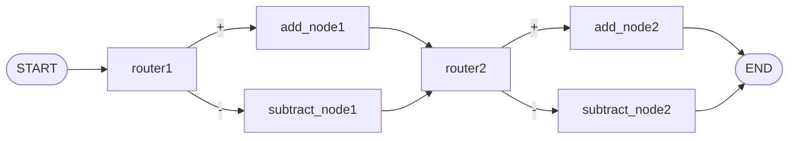

# lalalangraph

A small [LangGraph](https://github.com/langchain-ai/langgraph) sandbox for learning how to build stateful, node-based graphs.

## Getting started

Requirements:

- Python >= 3.14
- [uv](https://github.com/astral-sh/uv) for dependency management

Install dependencies:

```bash
uv sync
```

## Examples

Each script is a self-contained graph you can run with `uv run python <file>`.

### hello_world.py

A two-node graph that greets and compliments a person:

```
greeter → compliment
```

State flows through an `AgentState` dict carrying a `name` and a `message`. `greeter` builds the greeting from `name`, and `compliment` appends a compliment from the same `name`.

```bash
uv run python hello_world.py
# {'name': 'Santosh', 'message': 'Hey Santosh, how is your day going? You are doing amazing Santosh'}
```

### multiple_inputs.py

A single node that reads several fields off the state at once — a list of `values`, a `name`, and an `operation`:

```
processor
```

The `processor` node sums (`+`) or multiplies (`*`) the list and writes a personalized `result`.

```bash
uv run python multiple_inputs.py
# {'values': [12, 21, 33], 'name': 'Santosh', 'operation': '*', 'result': 'Hi there Santosh! Your answer is: 8316'}
```

### sequential_agent.py

Three nodes chained one after another, each appending to the same `final` string:

```
first_node → second_node → third_node
```

`first_node` greets by `name`, `second_node` adds the `age`, and `third_node` lists the `skills`. Nothing branches — it is the plain sequential case, where each node only extends what the previous one wrote.

```bash
uv run python sequential_agent.py
# {'name': 'Charlie', 'age': 20, 'skills': ['Python', 'TDD'], 'final': 'Hi Charlie. You are 20 years old! You are skilled in Python, TDD.'}
```

### conditional_agent.py

Two rounds of branching, where the path taken depends on the state rather than being fixed in advance:



`router1` and `router2` are pass-through nodes that do no work; the choice happens in the functions passed to `add_conditional_edges`. Each returns a branch key — `"addition_operation"` or `"subtraction_operation"` — which the mapping dict translates into the next node. `decide_first_operation` reads `operation1` to pick the first pair, `decide_second_operation` reads `operation2` to pick the second. Both are typed with `Literal[...]` so a mistyped branch key is caught by the type checker instead of at runtime.

The two operations are independent, so mixed operators take different branches in each half:

```bash
uv run python conditional_agent.py
# {'number1': 10, 'operation1': '-', 'number2': 5, 'finalNumber1': 5, 'number3': 20, 'operation2': '-', 'number4': 10, 'finalNumber2': 10}
# {'number1': 10, 'operation1': '+', 'number2': 5, 'finalNumber1': 15, 'number3': 20, 'operation2': '+', 'number4': 10, 'finalNumber2': 30}
# {'number1': 10, 'operation1': '+', 'number2': 5, 'finalNumber1': 15, 'number3': 20, 'operation2': '-', 'number4': 10, 'finalNumber2': 10}
```
